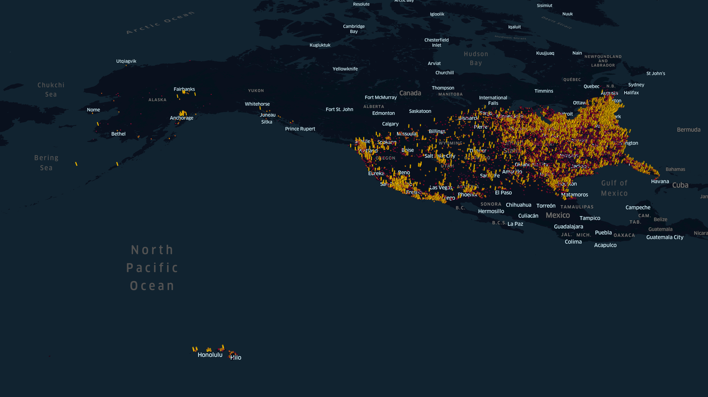

# Median US Household Income

The data used in this visualization is from [Golden Oak Research Group, LLC. “U.S. Income Database Kaggle”. Publication: 5, August 2017. Accessed, 26, Oct 2020.](https://www.kaggle.com/goldenoakresearch/us-household-income-stats-geo-locations?select=kaggle_income.csv)

## Build
To build this visualization yourself:
1. Download the data from the kaggle link above and extract it into `us-household-income/data`
2. Install requirements
3. $ python main.py

The generated map will be in the project's root directory, called `index.html`.

### Requirements
- keplergl
- pandas
